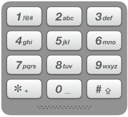

# 17.电话号码的字母组合

给定一个仅包含数字 2-9 的字符串，返回所有它能表示的字母组合。答案可以按 任意顺序 返回。

给出数字到字母的映射如下（与电话按键相同）。注意 1 不对应任何字母。

<div align=center>
    
</div>

**示例 1：**

输入：`digits` = `"23"`
输出：`["ad","ae","af","bd","be","bf","cd","ce","cf"]`

**示例 2：**

输入：`digits = ""`
输出：`[]`

**示例 3：**

输入：`digits = "2"`
输出：`["a","b","c"]`

**提示：**

$0 <= digits.length <= 4$
$digits[i]$ 是范围 ['$2$', '$9$'] ​的一个数字。

## 题目链接

[17. 电话号码的字母组合](https://leetcode-cn.com/problems/letter-combinations-of-a-phone-number/)

## 题解

回溯算法较好的例题，套用回溯算法框架易得代码。

**框架如下：**

```python
result = []
def backtrack(路径，选择列表)：
	if 满足结束条件：
    	result.add(路径)
        return
    for 选择 in 选择列表：
    	做选择
        backtrack(路径，选择列表)
        撤销选择
```

**代码如下：**

```cpp
class Solution {
public:
    vector<string>res;
    unordered_map<char, string> digit2str = {
        {'2', "abc"},
        {'3', "def"},
        {'4', "ghi"},
        {'5', "jkl"},
        {'6', "mno"},
        {'7', "pqrs"},
        {'8', "tuv"},
        {'9', "wxyz"}
    };
    vector<string> letterCombinations(string digits) {
        if( digits.size() == 0 ){
            return res;
        }
        backtrack(digits, "", 0);
        return res;
    }
    //i是digits的下标，j是数字代表字符串中的下标
    void backtrack(string digits, string str, int i){
        if( str.size() == digits.size() ){
            res.push_back( str );
        }
        if( i >= digits.size() ){
            return;
        }
        for(int m = 0; m < digit2str[digits[i]].size(); m++){
            str.push_back( digit2str[digits[i]][m]  );
            backtrack( digits, str, i+1);
            str.pop_back();
        }
    }
};
```

1. 利用`unordered_map`数据结构预先存放数字对应的字符串。
2. 结束条件：`str`是生成的字符串，当其长度与数字的个数相等时，此时`str`就是字母组合之一。
3. `i`代表`digits`的下标，当`i == dights.size()`，此时`str`的第`i`个位置便无法放入字母，可直接返回。

<div align=right>
    2021年2月16日
</div>


