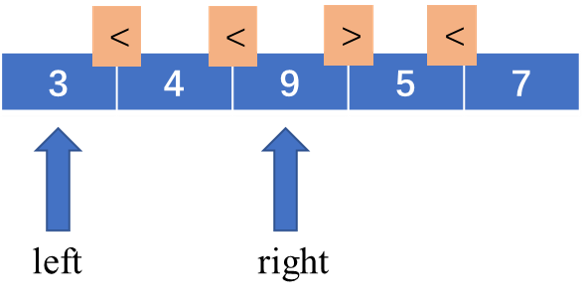
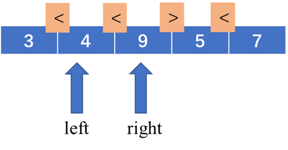

# 978、最长湍流子数组

当 `A` 的子数组 `A[i], A[i+1], ..., A[j]` 满足下列条件时，我们称其为*湍流子数组*：

- 若 `i <= k < j`，当 `k` 为奇数时， `A[k] > A[k+1]`，且当 `k` 为偶数时，`A[k] < A[k+1]`；
- **或** 若 `i <= k < j`，当 `k` 为偶数时，`A[k] > A[k+1]` ，且当 `k` 为奇数时， `A[k] < A[k+1]`。

也就是说，如果比较符号在子数组中的每个相邻元素对之间翻转，则该子数组是湍流子数组。

返回 `A` 的最大湍流子数组的**长度**。

**示例 1：**

```
输入：[9,4,2,10,7,8,8,1,9]
输出：5
解释：(A[1] > A[2] < A[3] > A[4] < A[5])
```

**示例 2：**

```
输入：[4,8,12,16]
输出：2
```

**示例 3：**

```
输入：[100]
输出：1
```

**提示：**

1. `1 <= A.length <= 40000`
2. `0 <= A[i] <= 10^9`

## 题解

### 方法一：滑动窗口

对于滑动窗口的细致讲解，可以查看[滑动窗口算法解决子串问题](http://mp.weixin.qq.com/s?__biz=MzAxODQxMDM0Mw==&mid=2247484504&idx=1&sn=5ecbab87e42033cc0a62b635cc436977&chksm=9bd7fa50aca07346a3ffa6be6fccc445968c162af9532fa9c6304eaab2e3a1b79a4bbe758c0a&mpshare=1&scene=23&srcid=0208I9fHzE7IGftefGAyfeM8&sharer_sharetime=1612791241871&sharer_shareid=10c6cc491bc58481e1580e5e142c09fe#rd)

求子串、子数组这样的题型，首先我们可以考虑滑动窗口的方法。接下来看具体分析：

根据湍流子数组的定义，我们知道，对于一个长度为 `n` 的湍流数组，我们可以在 `n-1` 个空中填入`> `和`<`，且相邻的空符号不相同。这里其实就要注意一个问题，不能填入`=`，也就是说，如果数组中有`=`，那么就不是湍流数组。在处理中，我们要对相邻元素相等的情况进行判断。其实，填入`=`的位置可以把数组分为左右两个部分，这两部分中的元素不可能同时出现在湍流子数组中。

我们要怎么判断每次要插入什么符号呢？这里我么引入一个`bool`变量，用`true`代表`>`，`false`代表`<`。如果前一次的符号是`>`，那么下次必定是`<`，我们可以用对变量取反的方式实现。

我们什么时候需要扩张窗口，什么时候需要收缩窗口呢？

我们用`left`和`right`表示窗口边界

很明显，如果当前`[left, right]`区间是湍流子数组，并且` arr[right] > arr[right-1]`此时，我们肯定需要扩大窗口 (`right<-right  + 1`) 来看是否可以有更长的湍流子数组。假设此时`arr[right] > arr[right-1]`，显然，此时`[left, right]`区间不再是湍流子数组。这时候我们就要对窗口进行收缩，即对`left`指针右移，右移到什么位置呢？

<div align=center>
    
</div>

如图，当前`[left, right]`区间已经不是湍流子数组，但是注意，数组元素只有两个的时候，如果两个元素不相等，那么他就肯定是湍流数组，所以，我们应该要把`left`移到`right-1`。此时，`[left, right]`则是一个湍流数租。

<div align=center>
    
</div>

当`right`到达数组末端的时候，程序就结束了。整个程序只对数组遍历了一次，时间复杂度为`O(n)`。

**代码：**

```c++
class Solution {
public:
    int maxTurbulenceSize(vector<int>& arr) {
        if( arr.size() == 0 ) return 0;
        if( arr.size() == 1 ) return 1;
        int left = 0, right = 1;
        //cmp为true，代表A[i] > A[i-1]，false相反
        bool cmp;
      	//对数组首端元素相等的情形进行窗口滑动
        while( arr[right] == arr[left] && right < arr.size()){
            left++;
            right++;
            if( right == arr.size() ){
                return 1;
            }
        }
        cmp = arr[right] > arr[left] ? true : false;
        right++;
        int maxLen = 2;
        while( right < arr.size() ){
            if( arr[right] > arr[right-1] == !cmp && arr[right] != arr[right-1]){
                maxLen = max(maxLen, right - left + 1);
                cmp = !cmp;
            }else{
                //这种情况包含了arr[right] == arr[right-1]，但是没关系，我们在后面的代码中进行了重判。
                left = right-1;
                cmp = arr[right] > arr[left] ? true : false;
            }

            if( arr[right] == arr[right-1] ){
                left = right;
                right++;
                if( right < arr.size() ){
                    cmp = arr[right] > arr[left] ? true : false;
                }else{
                    return maxLen;
                }
            }
            right++;
        }
        return maxLen;
    }

};
```

代码还可以进行简化，此处不再修改，重要的是思想。

### 动态规划

此处直接放官方题解

记 $\textit{dp}[i][0]$ 为以 $arr[i]$ 结尾，且 $arr[i−1]>arr[i]$ 的「湍流子数组」的最大长度；$dp[i][1] $为以 $arr[i]$ 结尾，且 $arr[i−1]<arr[i]$ 的「湍流子数组」的最大长度。

显然，以下标 $0$ 结尾的「湍流子数组」的最大长度为$ 11$，因此边界情况为$ dp[0][0]=dp[0][1]=1$。

当$ i>0$ 时，考虑 $arr[i−1]$ 和 $arr[i]$ 之间的大小关系：

如果 $arr[i−1]>arr[i]$，则如果以下标 $i-1$ 结尾的子数组是「湍流子数组」，应满足 $i-1=0$，或者当$ i-1>0$ 时 $arr[i−2]<arr[i−1]$，因此 $dp[i][0]=dp[i−1][1]+1，dp[i][1]=1$；

如果 $arr[i−1]<arr[i]$，则如果以下标 $i-1$ 结尾的子数组是「湍流子数组」，应满足 $i-1=0$，或者当 $i-1>0$ 时 $arr[i−2]>arr[i−1]$，因此 $dp[i][0]=1$，$dp[i][1]=dp[i−1][0]+1$；

如果 $arr[i−1]=arr[i]$，则 $arr[i−1]$ 和 $arr[i]$ 不能同时出现在同一个湍流子数组中，因此 $dp[i][0]=dp[i][1]=1$。

最终，$\textit{dp}$ 数组的最大值即为所求的答案。

**代码：**

```c++
class Solution {
public:
    int maxTurbulenceSize(vector<int>& arr) {
        //dp[i][0]表示arr[0:i]，满足arr[i-1] > arr[i]的子数组湍流子数组长度
        if( arr.size() == 0 ) return 0;
        if( arr.size() == 1 ) return 1;
        vector<vector<int> > dp(arr.size(), vector<int>(2,1));
        dp[0][0] = 1;
        dp[0][1] = 1;
        for(int i = 1; i < arr.size(); i++){
            if( arr[i] > arr[i-1] ){
                dp[i][1] = dp[i-1][0]+1;
            }else if( arr[i] < arr[i-1] ){
                dp[i][0] = dp[i-1][1]+1;
            }else{
                dp[i][0] = 1;
                dp[i][1] = 1;
            }
        }
        int ret = 1;
        for (int i = 0; i < arr.size(); i++) {
            ret = max(ret, dp[i][0]);
            ret = max(ret, dp[i][1]);
        }
        return ret;
    }
};
```

<div align=right>
    2021年2月8日
</div>

