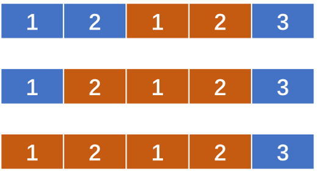
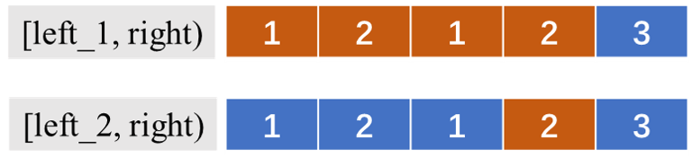

# 991、K 个不同整数的子数组

给定一个正整数数组 `A`，如果 `A` 的某个子数组中不同整数的个数恰好为 `K`，则称 `A` 的这个连续、不一定独立的子数组为**好子数组**。

（例如，`[1,2,3,1,2]` 中有 `3` 个不同的整数：`1`，`2`，以及 `3`。）

返回 `A` 中**好子数组**的数目。

**示例 1：**

```
输入：A = [1,2,1,2,3], K = 2
输出：7
解释：恰好由 2 个不同整数组成的子数组：[1,2], [2,1], [1,2], [2,3], [1,2,1], [2,1,2], [1,2,1,2].
```

**示例 2：**

```
输入：A = [1,2,1,3,4], K = 3
输出：3
解释：恰好由 3 个不同整数组成的子数组：[1,2,1,3], [2,1,3], [1,3,4].
```

 

**提示：**

1. `1 <= A.length <= 20000`
2. `1 <= A[i] <= A.length`
3. `1 <= K <= A.length`

## 题解

前面的题目中总结过，对于子串问题我们常使用滑动窗口的方法求解，这题的难度标的是困难，但是第一眼只是觉得是个非常简单的滑动窗口，于是很快利用之前的框架，写出了初版代码：

初版**错误**代码：

```c++
class Solution {
public:
    int subarraysWithKDistinct(vector<int>& A, int K) {
        unordered_map<int, int>window;
        int left = 0, right = 0;
        int res = 0;
        while( right < A.size() ){
            int num = A[right];
            right++;
            window[num]++;
            if( window.size() == K ){
                res++;
            }
            
            while( window.size() > K ){
                int tmp = A[left];
                left++;
                if( window[tmp] == 1 ){
                    window.erase(tmp);
                    if( window.size() == K ){
                        res++;
                    }
                }else {
                    window[tmp]--;
                }
            }
        }
        return res;
    }
};
```

如果你可以看出前面代码的错误之处，那么接下来的分析想必你会比较清楚了。

<div align=center>
    
</div>

按照上面的代码，窗口扩张的时候，会出现`[1,2]、[1,2,1]、[1,2,1,2]`三个子数组。当窗口扩张到上图这个状态后时，窗口会从左边进行收缩，在收缩过程中，会出现`[2,3]`这一个子数组，很明显这个过程漏了`[2,1]、[2,1,2]`等子数组。

仔细观察会发现，对于一个右边界，可能对应多个左边界满足条件，比如：

<div align=center>
    
</div>

上面三个窗口都满足有2个不同整数。因此我们需要设定两个窗口，对应两个左边界：

对于每一个右边界`right`，设置两个左边界`left_1`和`left_2`，`[left_1, right]`区间表示有K个不同整数的子数组的区间，`[left_2, right)`表示有`K-1`个不同整数的子数组，不过注意，`[left_1 - 1, right)`是有`K+1`个不同整数的子数组，`[left_2 - 1, right)`是有`K`个不同整数的子数组。也就是说，两个左边界都是满足要求的左边界中最小的值。那么在`[left_1, left_2)`区间的元素，都可以作为`left`边界和`right`边界组成`[left， right)`这样一个区间，使此区间满足是`K`个不同整数的子数组

<div align=center>
    
</div>

**代码：**


```c++
class Solution {
public:
    int subarraysWithKDistinct(vector<int>& A, int K) {
        unordered_map<int, int>window_1;
        unordered_map<int, int>window_2;
        int left_1 = 0, left_2= 0, right = 0;

        int res = 0;
        while( right < A.size() ){
            int num = A[right];
            right++;
            window_1[num]++;
            window_2[num]++;
            
            while( window_1.size() > K ){
                int c = A[left_1];
                left_1++;
                if( window_1[c] == 1){
                    window_1.erase(c);
                }else{
                    window_1[c]--;
                }
            }
            while( window_2.size() == K ){
                int c = A[left_2];
                left_2++;
                if( window_2[c] == 1){
                    window_2.erase(c);
                }else{
                    window_2[c]--;
                }
            }
            res+=left_2 - left_1;
        }
        return res;
    }
};
```

<div align=right>
    2021年2月9日
</div>

