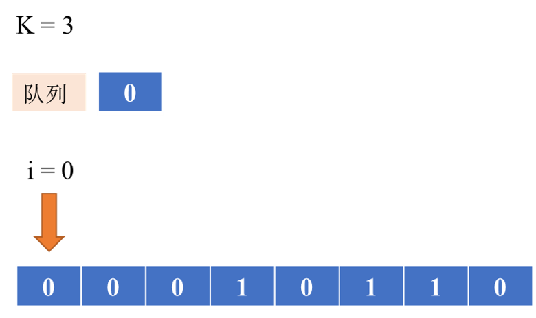
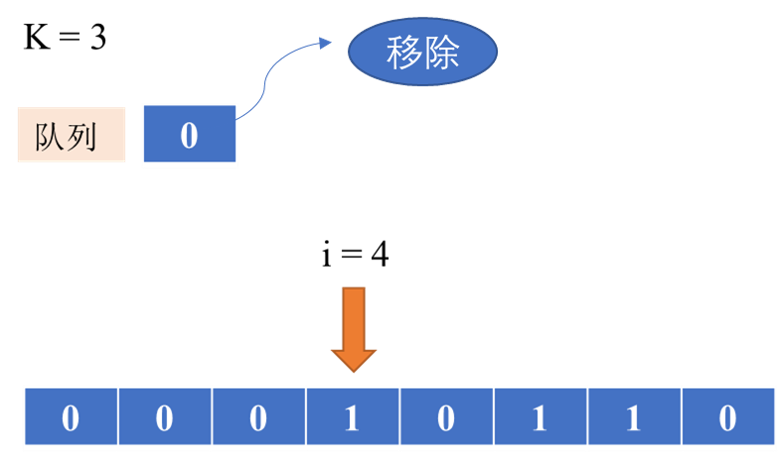

# 995. K 连续位的最小翻转次数

## 题目描述

在仅包含 `0` 和 `1` 的数组 `A` 中，一次 *`K` 位翻转*包括选择一个长度为 `K` 的（连续）子数组，同时将子数组中的每个 `0` 更改为 `1`，而每个 `1` 更改为 `0`。

返回所需的 `K` 位翻转的最小次数，以便数组没有值为 `0` 的元素。如果不可能，返回 `-1`。

**示例 1：**

```
输入：A = [0,1,0], K = 1
输出：2
解释：先翻转 A[0]，然后翻转 A[2]。
```

**示例 2：**

```
输入：A = [1,1,0], K = 2
输出：-1
解释：无论我们怎样翻转大小为 2 的子数组，我们都不能使数组变为 [1,1,1]。
```

**示例 3：**

```
输入：A = [0,0,0,1,0,1,1,0], K = 3
输出：3
解释：
	翻转 A[0],A[1],A[2]: A变成 [1,1,1,1,0,1,1,0]
	翻转 A[4],A[5],A[6]: A变成 [1,1,1,1,1,0,0,0]
	翻转 A[5],A[6],A[7]: A变成 [1,1,1,1,1,1,1,1]
```

**提示：**

1. `1 <= A.length <= 30000`
2. `1 <= K <= A.length`

**题目链接：**

[995. K 连续位的最小翻转次数](https://leetcode-cn.com/problems/minimum-number-of-k-consecutive-bit-flips/)

## 题解

#### （一）模拟翻转（超时）：

一个直观的思路是，从左到右遍历一遍，遇到数字为 $0$，那么翻转以该数字为起始的 $K$ 个数字。然而超时，代码就不放了。

#### （二）滑动窗口：

上面的方法之所以超时，是因为我们模拟了翻转的过程，翻转偶数次相当于不翻转，翻转奇数次相当于翻转 $1$ 次，我们可以用队列表示窗口，记录需要翻转的 $K$ 个元素的首下标。但是需要记住的是，放入队列的只有一个下标，但实际翻转的有 $K$ 个元素，也就是说，当前元素要不要翻转，取决于之前翻转了几次以及 $i$ 位置的元素，接下来是具体过程：

如果队列中有`x`个元素，则就代表当前元素在之前会被翻转`x`次，当然，获取队列的大小之前，要在队列中去除对当前元素没有影响的元素。即：

```cpp
if( !window.empty() && i >= window.front() + K ){
	window.pop();
}
```

如下图：

<div align=center>
    
</div>

<hr/>

<div align=center>
    
</div>

<hr/>

1. 如果 $i$ 位置的元素翻转了偶数次，并且`A[i] = 0`，那么此时`A[i]`还需要翻转;
2. 如果 $i$ 位置的元素翻转了奇数次，并且`A[i] = 1`，那么此时`A[i]`还需要翻转。

如此可以得出，`queue.size()  % 2 == A[i]` 时，`A[i]` 便需要翻转。当然，如果`A[i]`需要翻转，但是已经没有 $K$ 个位置供翻转，此时就无法得出答案，返回`-1`。即：

```cpp
if( window.size() % 2 == A[i] ){
	if( i + K > n ) 
        	return -1;
	window.push(i);
	res++;
}
```

**代码：**

```cpp
class Solution {
public:
    int minKBitFlips(vector<int>& A, int K) {
        queue<int> window;
        int res = 0;
        int n = A.size();
        for(int i = 0; i < n; i++){
            if( !window.empty() && i >= window.front() + K ){
                window.pop();
            }
            if( window.size() % 2 == A[i] ){
                if( i + K > n ) return -1;
                window.push(i);
                res++;
            }
        }
        return res;
    }
};
```

<div align=right>
    2021年2月18日
</div>

