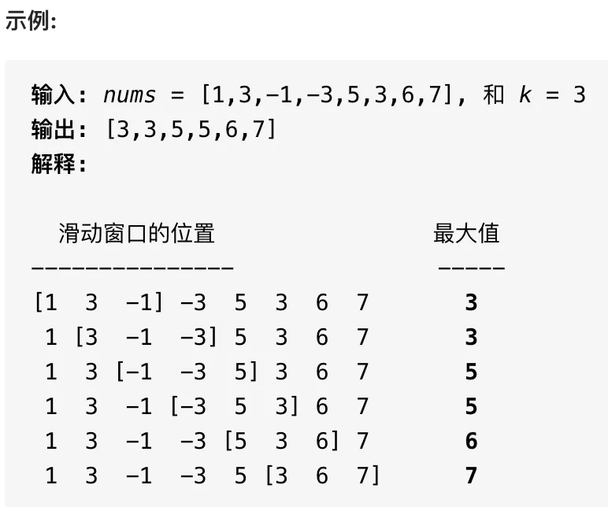
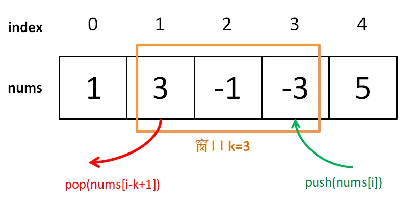
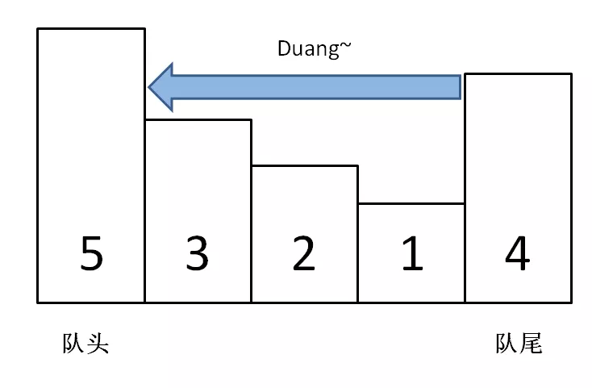
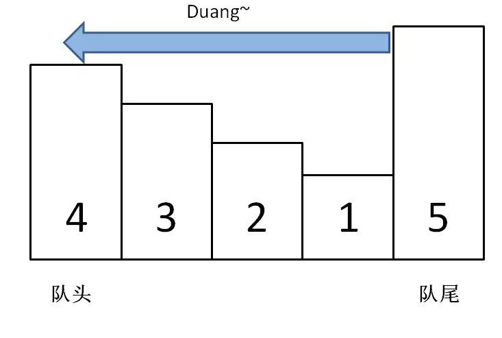

读完本文，可以去力扣解决如下题目：

239.滑动窗口最大值（**Hard**）

前文用 [单调栈解决三道算法问题](http://mp.weixin.qq.com/s?__biz=MzAxODQxMDM0Mw==&mid=2247487704&idx=1&sn=eb9ac24c644aa0950638c9b20384e982&chksm=9bd7eed0aca067c6b4424c40b7f234c815f83edfbb5efc9f51581335f110e9577114a528f3ec&scene=21#wechat_redirect) 介绍了单调栈这种特殊数据结构，本文写一个类似的数据结构「单调队列」。  

也许这种数据结构的名字你没听过，其实没啥难的，就是一个「队列」，只是使用了一点巧妙的方法，使得**队列中的元素全都是单调递增（或递减）的**。

「单调栈」主要解决 Next Great Number 一类算法问题，而「单调队列」这个数据结构可以解决滑动窗口问题。我们之前的爆文 [滑动窗口解题套路框架](http://mp.weixin.qq.com/s?__biz=MzAxODQxMDM0Mw==&mid=2247485141&idx=1&sn=0e4583ad935e76e9a3f6793792e60734&chksm=9bd7f8ddaca071cbb7570b2433290e5e2628d20473022a5517271de6d6e50783961bebc3dd3b&scene=21#wechat_redirect) 讲的滑动窗口算法是双指针技巧的一种，是解决子串、子数组的通用技巧；而本文说的滑动窗口是比较具体的问题。

比如说力扣第 239 题「滑动窗口最大值」，难度 **Hard**：  

给你输入一个数组`nums`和一个正整数`k`，有一个大小为`k`的窗口在`nums`上从左至右滑动，请你输出每次窗口中`k`个元素的最大值。

函数签名如下：

```c++
int[] maxSlidingWindow(int[] nums, int k);
```

比如说题目给出的一个示例：

<div align=center>
    
</div>

### 一、搭建解题框架

这道题不复杂，难点在于如何在`O(1)`时间算出每个「窗口」中的最大值，使得整个算法在线性时间完成。这种问题的一个特殊点在于，「窗口」是不断滑动的，也就是你得**动态地**计算窗口中的最大值。

对于这种动态的场景，很容易得到一个结论：

**在一堆数字中，已知最值为`A`，如果给这堆数添加一个数`B`，那么比较一下`A`和`B`就可以立即算出新的最值；但如果减少一个数，就不能直接得到最值了，因为如果减少的这个数恰好是`A`，就需要遍历所有数重新找新的最值**。

回到这道题的场景，每个窗口前进的时候，要添加一个数同时减少一个数，所以想在 O(1) 的时间得出新的最值，不是那么容易的，需要「单调队列」这种特殊的数据结构来辅助。

一个普通的队列一定有这两个操作：

```c++
class Queue {
    // enqueue 操作，在队尾加入元素 n
    void push(int n);
    // dequeue 操作，删除队头元素
    void pop();
}
```

一个「单调队列」的操作也差不多：

```c++
class MonotonicQueue {
    // 在队尾添加元素 n
    void push(int n);
    // 返回当前队列中的最大值
    int max();
    // 队头元素如果是 n，删除它
    void pop(int n);
}
```

当然，这几个 API 的实现方法肯定跟一般的 Queue 不一样，不过我们暂且不管，而且认为这几个操作的时间复杂度都是 O(1)，先把这道「滑动窗口」问题的解答框架搭出来：

```c++
int[] maxSlidingWindow(int[] nums, int k) {
    MonotonicQueue window = new MonotonicQueue();
    List<Integer> res = new ArrayList<>();

    for (int i = 0; i < nums.length; i++) {
        if (i < k - 1) {
            //先把窗口的前 k - 1 填满
            window.push(nums[i]);
        } else {
            // 窗口开始向前滑动
            // 移入新元素
            window.push(nums[i]);
            // 将当前窗口中的最大元素记入结果
            res.add(window.max());
            // 移出最后的元素
            window.pop(nums[i - k + 1]);
        }
    }
    // 将 List 类型转化成 int[] 数组作为返回值
    int[] arr = new int[res.size()];
    for (int i = 0; i < res.size(); i++) {
        arr[i] = res.get(i);
    }
    return arr;
}

```

<div align=center>
    
</div>

这个思路很简单，能理解吧？下面我们开始重头戏，单调队列的实现。

### 二、实现单调队列数据结构

观察滑动窗口的过程就能发现，实现「单调队列」必须使用一种数据结构支持在头部和尾部进行插入和删除，很明显双链表是满足这个条件的。

「单调队列」的核心思路和「单调栈」类似，`push`方法依然在队尾添加元素，但是要把前面比自己小的元素都删掉：

```c++
class MonotonicQueue {
    // 双链表，支持头部和尾部增删元素
    private LinkedList<Integer> q = new LinkedList<>();

    public void push(int n) {
    // 将前面小于自己的元素都删除
        while (!q.isEmpty() && q.getLast() < n) {
            q.pollLast();
        }
        q.addLast(n);
    }
}
```

你可以想象，加入数字的大小代表人的体重，把前面体重不足的都压扁了，直到遇到更大的量级才停住。

<div align=center>
    
</div>

如果每个元素被加入时都这样操作，最终单调队列中的元素大小就会保持一个**单调递减**的顺序，因此我们的`max`方法可以可以这样写：

```c++
public int max() {
    // 队头的元素肯定是最大的
    return q.getFirst();
}
```

`pop`方法在队头删除元素`n`，也很好写：

```c++
public void pop(int n) {
    if (n == q.getFirst()) {
        q.pollFirst();
    }
}
```

之所以要判断`data.front() == n`，是因为我们想删除的队头元素`n`可能已经被「压扁」了，可能已经不存在了，所以这时候就不用删除了：

<div align=center>
    
</div>

至此，单调队列设计完毕，看下完整的解题代码：

```c++
/* 单调队列的实现 */
class MonotonicQueue {
    LinkedList<Integer> q = new LinkedList<>();
    public void push(int n) {
        // 将小于 n 的元素全部删除
        while (!q.isEmpty() && q.getLast() < n) {
            q.pollLast();
        }
        // 然后将 n 加入尾部
        q.addLast(n);
    }

    public int max() {
        return q.getFirst();
    }

    public void pop(int n) {
        if (n == q.getFirst()) {
            q.pollFirst();
        }
    }
}

/* 解题函数的实现 */
int[] maxSlidingWindow(int[] nums, int k) {
    MonotonicQueue window = new MonotonicQueue();
    List<Integer> res = new ArrayList<>();

    for (int i = 0; i < nums.length; i++) {
        if (i < k - 1) {
            //先填满窗口的前 k - 1
            window.push(nums[i]);
        } else {
            // 窗口向前滑动，加入新数字
            window.push(nums[i]);
            // 记录当前窗口的最大值
            res.add(window.max());
            // 移出旧数字
            window.pop(nums[i - k + 1]);
        }
    }
    // 需要转成 int[] 数组再返回
    int[] arr = new int[res.size()];
    for (int i = 0; i < res.size(); i++) {
        arr[i] = res.get(i);
    }
    return arr;
}
```

有一点细节问题不要忽略，在实现`MonotonicQueue`时，我们使用了 Java 的`LinkedList`，因为链表结构支持在头部和尾部快速增删元素；而在解法代码中的`res`则使用的`ArrayList`结构，因为后续会按照索引取元素，所以数组结构更合适。

### 三、算法复杂度分析

读者可能疑惑，`push`操作中含有 while 循环，时间复杂度应该不是`O(1)`呀，那么本算法的时间复杂度应该不是线性时间吧？

单独看`push`操作的复杂度确实不是`O(1)`，但是算法整体的复杂度依然是`O(N)`线性时间。要这样想，`nums`中的每个元素最多被`push_back`和`pop_back`一次，没有任何多余操作，所以整体的复杂度还是`O(N)`。

空间复杂度就很简单了，就是窗口的大小`O(k)`。

