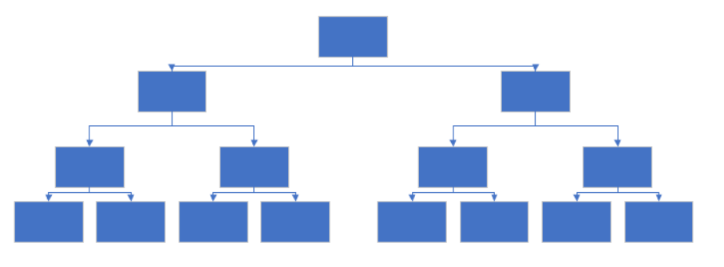
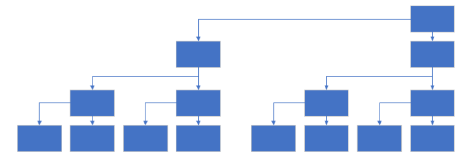
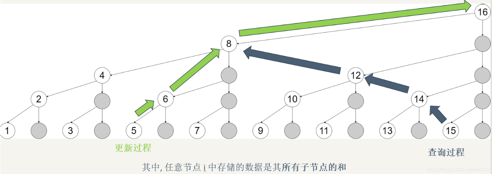
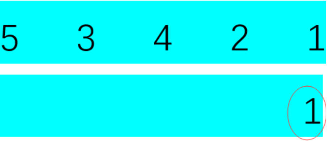
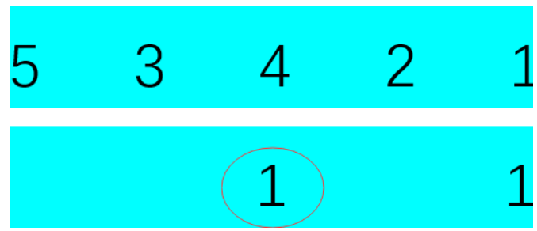
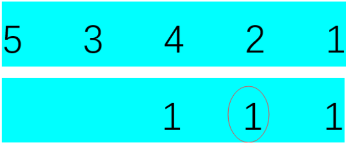
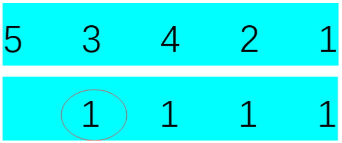
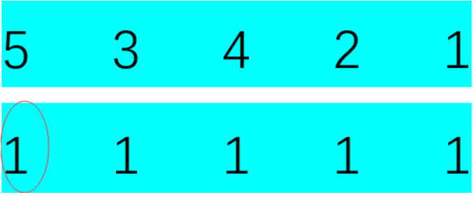

转自[bestsort.cn](https://bestsort.cn/)

树状数组基础
==============

树状数组是一个查询和修改复杂度都为 log(n) 的数据结构。主要用于数组的单点修改 && 区间求和.

另外一个拥有类似功能的是[线段树](https://bestsort.cn/2019/04/28/482/)

具体区别和联系如下：

**1.** 两者在复杂度上同级, 但是树状数组的常数明显优于线段树, 其编程复杂度也远小于线段树.

**2.** 树状数组的作用被线段树完全涵盖, 凡是可以使用树状数组解决的问题, 使用线段树一定可以解决, 但是线段树能够解决的问题树状数组未必能够解决.

**3.** 树状数组的突出特点是其编程的极端简洁性, 使用 lowbit 技术可以在很短的几步操作中完成树状数组的核心操作，其代码效率远高于线段树。

上面出现了一个新名词: lowbit. 其实 lowbit(x) 就是求 x 最低位的 1;

下面加图进行解释

对于一般的二叉树, 我们是这样画的。

<div align=center>

</div>


把位置稍微移动一下, 便是树状数组的画法

<div align=center>
    
</div>


一图秒懂
----

重头戏来了，bestsort 教你一图学会树状数组~(咱也不知道为啥其他博客写那么复杂

需要注意的是，图中的子节点包括自己，比如说 8 这个节点，里面的值是原始数组中 [5,8] 的和

**标记为灰色的节点实际已被上层覆盖, 不占据空间**

<div align=center>
    
</div>


下面是二进制版本，能看到

更新过程是每次加了个二进制的低位 1(101+1 ->110, 110 + 10 -> 1000, 1000 + 1000 -> 10000)

查询过程每次就是去掉了二进制中的低位 1(1111 - 1 -> 1110, 1110 - 10 -> 1100, 1100 - 100 -> 1000)

<div align=center>
    
</div>


开篇就说了, lowbit(x) 是取出 x 的最低位 1; 具体操作为

```c++
int lowbit(x){return x&(-x);}
```

极致简短!!!! 现在我们来理解一下这行代码:

我们知道, 对于一个数的负数就等于对这个数取反 + 1

以二进制数 11010 为例: 11010 的补码为 00101, 加 1 后为 00110, 两者相与便是最低位的 1

其实很好理解, 补码和原码必然相反, 所以原码有 0 的部位补码全是 1, 补码再 + 1 之后由于进位那么最末尾的 1 和原码

最右边的 1 一定是同一个位置 (当遇到第一个 1 的时候补码此位为 0, 由于前面会进一位, 所以此位会变为 1)

所以我们只需要进行 a&(-a) 就可以取出最低位的 1 了

会了 lowbit, 我们就可以进行区间查询和单点更新了!!!

--------------------------------------------------------------------------------------------

单点更新:
-----

继续看开始给出的图

此时如果我们要更改 A[1]

则有以下需要进行同步更新

1(001)        **C[1]+=A[1]**

lowbit(1)=001 1+lowbit(1)=2(010)     **C[2]+=A[1]**

lowbit(2)=010 2+lowbit(2)=4(100)     **C[4]+=A[1]**

lowbit(4)=100 4+lowbit(4)=8(1000)   **C[8]+=A[1]**

换成代码就是:

```c++
void update(int x,int y,int n){
    for(int i=x;i<=n;i+=lowbit(i))    //x为更新的位置,y为更新后的数,n为数组最大值
        c[i] += y;
}
```

--------------------------------------------------------------------------------------------

**区间查询:**
---------

举个例子 i=5

C[4]=A[1]+A[2]+A[3]+A[4]; 

C[5]=A[5];

可以推出:   sum(i = 5)  ==> C[4]+C[5];

序号写为二进制: sum(101)=C[(100)]+C[(101)];

第一次 101, 减去最低位的 1 就是 100;

其实也就是单点更新的逆操作

代码如下:

```c++
int getsum(int x){
    int ans = 0;
    for(int i=x;i;i-=lowbit(i))
        ans += c[i];
    return ans;
}
```

lowbit 会了, 区间查询有了, 单点更新也有了接下来该做题了

单击传送门移步 [HDU1166 敌兵布阵](http://acm.hdu.edu.cn/showproblem.php?pid=1166)

附代码:

```c++
#include <iostream>
#include <cstdio>
#include <cstdlib>
#include <cstring>
#include <cmath>
#include <algorithm>
#include <queue>
#include <string>
#include <vector>
#define For(a,b) for(int a=0;a<b;a++)
#define mem(a,b) memset(a,b,sizeof(a))
#define _mem(a,b) memset(a,0,(b+1)<<2)
#define lowbit(a) ((a)&-(a))
using namespace std;
typedef long long ll;
const int maxn =  5*1e4+5;
const int INF = 0x3f3f3f3f;
int c[maxn];
void update(int x,int y,int n){
    for(int i=x;i<=n;i+=lowbit(i))
        c[i] += y;
}
int getsum(int x){
    int ans = 0;
    for(int i=x;i;i-=lowbit(i))
        ans += c[i];
    return ans;
}
int main()
{
    int t;
    int n;
    int x,y,z;
    string s;
    cin >> t ;
    for(int j=1;j<=t;j++){
        scanf("%d",&n);
        _mem(c,n);      //初始化数组中前n+1个数为0
        for(int i=1;i<=n;i++){
            scanf("%d",&z);
            update(i,z,n);
        }
        cout <<"Case "<<j<<":"<<endl;
        while(1){
            cin >> s;
            if(s[0] == 'E')
                break;
            scanf("%d%d",&x,&y);
            if(s[0] == 'Q')
                cout << getsum(y)-getsum(x-1)<<endl;
            else if(s[0] == 'A')
                update(x,y,n);
            else
                update(x,-y,n);
        }
    }
    return 0;
}
```

高级操作
====

求逆序对
----

### 操作

对于数组 a，我们将其离散化处理为 b[]. 区间查询与单点修改代码如下

```c++
void update(int p)
{
    while(p<=n)
    {
        a[p] ++;
        p+=lowbit(p);
    }
}
 
int getsum(int p)
{
    int res = 0;
    while(p)
        res += a[p],p -= lowbit(p);
    return res;
}
```

a 的逆序对个数为：

```c++
for(int i=1;i<=n;i++){
    update(b[i]+1);
    res += i-getsum(b[i]+1);
}
```

res 就是逆序对个数，ask，需注意 b[i] 应该大于 0

### 原理

**此部分来自 [ssimple_y 的博客](https://blog.csdn.net/ssimple_y)**

第一次插入的时候把 5 这个位置上加上 1，read(x) 值就是 1，当前已经插入了一个数，所以他前面比他大的数的个数就等于 i - read(x) = 1 - 1 = 0，所以总数 sum += 0

<div align=center>
    
</div>


第二次插入的时候，read(x) 的值同样是 1，但是 i - read(x) = 2 - 1 = 1，所以 sum += 1

<div align=center>
    
</div>


第三次的时候，read(x) 的值是 2，i - read(x) = 3 - 2 = 1，所以 sum += 1

<div align=center>
    
</div>


第四次，read(x) 的值是 1，i - read(x) = 4 - 1 = 3，所以 sum += 3

<div align=center>
    
</div>


第五次，read(x) 的值是 1，i - read(x) = 5 - 1 = 4，所以 sum += 4

<div align=center>
    
</div>


这样整个过程就结束了，所有的逆序对就求出来了。

求区间最大值
------

```c++
void Update(int i,int v)
{
    while(i<=maxY)
    {
        t[i] = max(t[i],v);
        i += lowbit(i);
    }
}
```

```c++
int query(int i)
{
    int ans = 0;
    while(i)
    {
        ans = max(ans,t[i]);
        i -= lowbit(i);
    }
    return ans;
}
```

该部分内容转自[胡小兔的 OI 博](https://www.cnblogs.com/RabbitHu/p/BIT.html)

区间修改 + 单点查询
-----------

通过 “差分”（就是记录数组中每个元素与前一个元素的差），可以把这个问题转化为问题 1。

### 查询

设原数组为, 设数组，则，可以通过求的前缀和查询。

### 修改

当给区间加上 x 的时候，与前一个元素 的差增加了 x，与 的差减少了 x。根据数组的定义，只需给加上 x, 给 减去 x 即可

```c++
void add(int p, int x){ //这个函数用来在树状数组中直接修改
    while(p <= n) sum[p] += x, p += p & -p;
}
void range_add(int l, int r, int x){ //给区间[l, r]加上x
    add(l, x), add(r + 1, -x);
}
int ask(int p){ //单点查询
    int res = 0;
    while(p) res += sum[p], p -= p & -p;
    return res;
}
```

区间修改 + 区间查询
-----------

这是最常用的部分，也是用线段树写着最麻烦的部分——但是现在我们有了树状数组！

怎么求呢？我们基于问题 2 的 “差分” 思路，考虑一下如何在问题 2 构建的树状数组中求前缀和：

位置 p 的前缀和 =

在等式最右侧的式子中，被用了 p 次，被用了次…… 那么我们可以写出：

位置 p 的前缀和 =

那么我们可以维护两个数组的前缀和：  
一个数组是   
另一个数组是 

### 查询

位置 p 的前缀和即：数组中 p 的前缀和 - sum2 数组中 p 的前缀和。

区间 [l, r] 的和即：位置 r 的前缀和 - 位置 l 的前缀和。

### 修改

对于 sum1 数组的修改同问题 2 中对 d 数组的修改。

对于 sum2 数组的修改也类似，我们给 sum2[l] 加上 l * x，给 sum2[r + 1] 减去 (r + 1) * x。

```c++
void add(ll p, ll x){
    for(int i = p; i <= n; i += i & -i)
        sum1[i] += x, sum2[i] += x * p;
}
void range_add(ll l, ll r, ll x){
    add(l, x), add(r + 1, -x);
}
ll ask(ll p){
    ll res = 0;
    for(int i = p; i; i -= i & -i)
        res += (p + 1) * sum1[i] - sum2[i];
    return res;
}
ll range_ask(ll l, ll r){
    return ask(r) - ask(l - 1);
}
```

用这个做区间修改区间求和的题，无论是时间上还是空间上都比带 lazy 标记的线段树要优。

二维树状数组
------

我们已经学会了对于序列的常用操作，那么我们不由得想到（谁会想到啊喂）…… 能不能把类似的操作应用到矩阵上呢？这时候我们就要写二维树状数组了！

在一维树状数组中，tree[x]（树状数组中的那个 “数组”）记录的是右端点为 x、长度为 lowbit(x) 的区间的区间和。  
那么在二维树状数组中，可以类似地定义 tree[x][y]记录的是右下角为 (x, y)，高为 lowbit(x), 宽为 lowbit(y) 的区间的区间和。

### 单点修改 + 区间查询

```c++
void add(int x, int y, int z){ //将点(x, y)加上z
    int memo_y = y;
    while(x <= n){
        y = memo_y;
        while(y <= n)
            tree[x][y] += z, y += y & -y;
        x += x & -x;
    }
}
void ask(int x, int y){//求左上角为(1,1)右下角为(x,y) 的矩阵和
    int res = 0, memo_y = y;
    while(x){
        y = memo_y;
        while(y)
            res += tree[x][y], y -= y & -y;
        x -= x & -x;
    }
}
```

### 区间修改 + 单点查询

我们对于一维数组进行差分，是为了使差分数组前缀和等于原数组对应位置的元素。

那么如何对二维数组进行差分呢？可以针对二维前缀和的求法来设计方案。

二维前缀和：


那么我们可以令差分数组表示与 的差。

例如下面这个矩阵

```
 1  4  8
 6  7  2
 3  9  5
```

对应的差分数组就是

```
 1  3  4
 5 -2 -9
-3  5  1
```

当我们想要将一个矩阵加上 x 时，怎么做呢？  
下面是给最中间的 3*3 矩阵加上 x 时，差分数组的变化：

```
0  0  0  0  0
0 +x  0  0 -x
0  0  0  0  0
0  0  0  0  0
0 -x  0  0 +x
```

这样给修改差分，造成的效果就是：

```
0  0  0  0  0
0  x  x  x  0
0  x  x  x  0
0  x  x  x  0
0  0  0  0  0
```

那么我们开始写代码吧！

```c++
void add(int x, int y, int z){ 
    int memo_y = y;
    while(x <= n){
        y = memo_y;
        while(y <= n)
            tree[x][y] += z, y += y & -y;
        x += x & -x;
    }
}
void range_add(int xa, int ya, int xb, int yb, int z){
    add(xa, ya, z);
    add(xa, yb + 1, -z);
    add(xb + 1, ya, -z);
    add(xb + 1, yb + 1, z);
}
void ask(int x, int y){
    int res = 0, memo_y = y;
    while(x){
        y = memo_y;
        while(y)
            res += tree[x][y], y -= y & -y;
        x -= x & -x;
    }
}
```

### 区间修改 + 区间查询

类比之前一维数组的区间修改区间查询，下面这个式子表示的是点 (x, y) 的二维前缀和：


(d[h][k]为点 (h, k) 对应的“二维差分”(同上题))

这个式子炒鸡复杂 ( 复杂度！)，但利用树状数组，我们可以把它优化到！

首先，类比一维数组，统计一下每个出现过多少次。出现了次，出现了次…… 出现了 次。

那么这个式子就可以写成：


把这个式子展开，就得到：


那么我们要开四个树状数组，分别维护：

,,,

这样就完成了！

```c++
#include <cstdio>
#include <cmath>
#include <cstring>
#include <algorithm>
#include <iostream>
using namespace std;
typedef long long ll;
ll read(){
    char c; bool op = 0;
    while((c = getchar()) < '0' || c > '9')
        if(c == '-') op = 1;
    ll res = c - '0';
    while((c = getchar()) >= '0' && c <= '9')
        res = res * 10 + c - '0';
    return op ? -res : res;
}
const int N = 205;
ll n, m, Q;
ll t1[N][N], t2[N][N], t3[N][N], t4[N][N];
void add(ll x, ll y, ll z){
    for(int X = x; X <= n; X += X & -X)
        for(int Y = y; Y <= m; Y += Y & -Y){
            t1[X][Y] += z;
            t2[X][Y] += z * x;
            t3[X][Y] += z * y;
            t4[X][Y] += z * x * y;
        }
}
void range_add(ll xa, ll ya, ll xb, ll yb, ll z){ //(xa, ya) 到 (xb, yb) 的矩形
    add(xa, ya, z);
    add(xa, yb + 1, -z);
    add(xb + 1, ya, -z);
    add(xb + 1, yb + 1, z);
}
ll ask(ll x, ll y){
    ll res = 0;
    for(int i = x; i; i -= i & -i)
        for(int j = y; j; j -= j & -j)
            res += (x + 1) * (y + 1) * t1[i][j]
                - (y + 1) * t2[i][j]
                - (x + 1) * t3[i][j]
                + t4[i][j];
    return res;
}
ll range_ask(ll xa, ll ya, ll xb, ll yb){
    return ask(xb, yb) - ask(xb, ya - 1) - ask(xa - 1, yb) + ask(xa - 1, ya - 1);
}
int main(){
    n = read(), m = read(), Q = read();
    for(int i = 1; i <= n; i++){
        for(int j = 1; j <= m; j++){
            ll z = read();
            range_add(i, j, i, j, z);
        }
    }
    while(Q--){
        ll ya = read(), xa = read(), yb = read(), xb = read(), z = read(), a = read();
        if(range_ask(xa, ya, xb, yb) < z * (xb - xa + 1) * (yb - ya + 1))
            range_add(xa, ya, xb, yb, a);
    }
    for(int i = 1; i <= n; i++){
        for(int j = 1; j <= m; j++)
            printf("%lld ", range_ask(i, j, i, j));
        putchar('\n');
    }
    return 0;
}
```