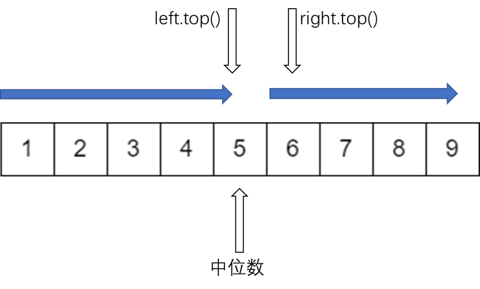
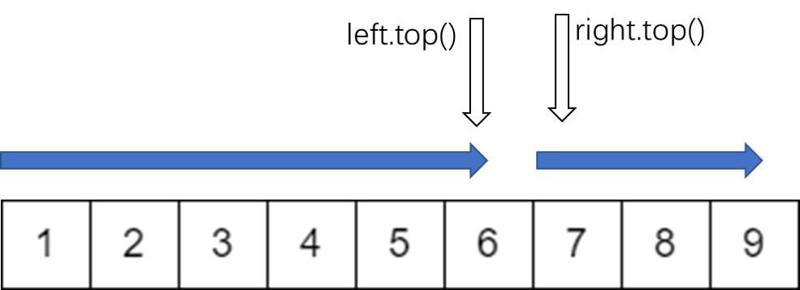
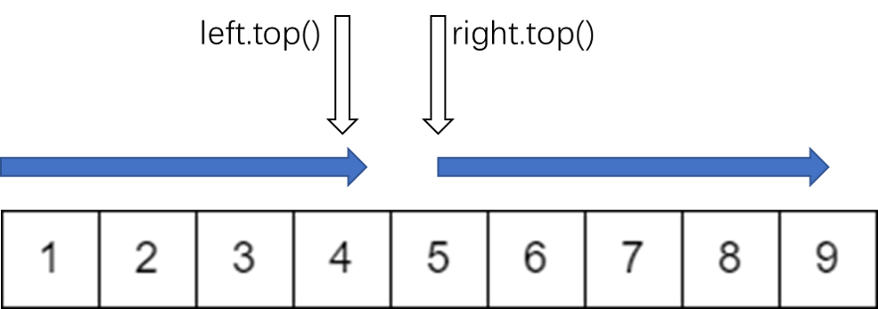

# P1168 中位数

## 题目描述

给出一个长度为N*N*的非负整数序列 $A_i$，对于所有 $1≤k≤(N+1)/2$，输出 $A_1$, $A_1 \sim A_3$, …,$A_1 \sim A_{2k - 1}$ 的中位数。即前 $1,3,5,…$ 个数的中位数。

## 输入格式

第 $1$ 行为一个正整数 $N$，表示了序列长度。

第 $2$ 行包含 $N$ 个非负整数 $A_i (A_i ≤ 10^9)$。

## 输出格式

共 $(N + 1) / 2$ 行，第 $i$ 行为 $A_1, A_3, …, A_{2k - 1}$ 的中位数。

## 输入输出样例

**输入**

```
7
1 3 5 7 9 11 6
```

**输出**

```
1
3
5
6
```

## 说明/提示

对于 $20\%$ 的数据，$N ≤ 100$；

对于 $40\%$ 的数据，$N ≤ 3000$；

对于 $100\%$ 的数据，$N ≤ 100000$。

## 题目链接

[P1168 中位数](https://www.luogu.com.cn/problem/P1168)

## 题解

### 数据结构：

```c++
priority_queue<int, vector<int>, less<int> > left;
```

## 思路讲解

假设现在有个已排好序的数组，如下：

<div align=center>

</div>


我们可以有以下几点结论：

1、首先，中位数的左边都小于这个中位数；

2、其次，中位数的右边都大于这个中位数；

3、中位数的左边是有次序从大往小排的;

4、中位数的右边是有次序从小往大排的；

那么根据堆的原理，左边堆顶存放中位数左边最大的值，右边堆顶存放中位数右边最小的值，这样就可以把中位数准确定位。

我们构造两个堆，左边是大根堆，右边是小根堆，由于中位数处在中间，我们把它放在左边的大根堆里，当然也可以放在右边的堆里。

那么我们要怎么操作呢？

首先，我们把第一个数读入 $left$ 队列，那么这个数自然是中位数，将其输出。

然后，我们每次读入两个数，设为 $x，y$ ,对于这两个数，如果小于原来的中位数，即 $left.top()$ ，那么我们就把它 $push$ 进 $left$ 里面，否则我们就把它 $push$ 进 $right$ 里面。为什么这么操作呢？因为 $left$ 里面存放的是比中位数小的数，所以把比原中位数小的数放入 $left$ 里面，同样， $left$ 里面存放的是比中位数大的数，所以把比原中位数大的数放入 $right$ 里面。

因为我们要保证 $left$ 里的元素要比 $right$ 里多一个(因为 $left$ 里比 $right$ 里多了一个中位数)。所以如果出现 $x,y$ 都放入了 $left$ 或 $right$ 里面。那么此时必定破坏了这个要求，所以我们要对两个队列进行维护，让 $left$ 里的元素要比 $right$ 里多一个。

**情况1：$x,y$ 都 $push$ 进 $left$**

<div align=center>

</div>


因为本身 $left$ 中的元素比 $right$ 中的元素多 $1$ 个，本来是 $left.size()-1 == right.size()$ ，然后变成了 $left.size()-1 > right.size()$，对于这种情况，说明 $left$ 中的堆顶元素不再是中位数，堆顶比中位数大，那么我们要把 $left$ 堆顶元素移动到 $right$ 里面。

**情况2：$x,y$ 都 $push$ 进 $right$**

<div align=center>

</div>

因为本身 $left$ 中的元素比 $right$ 中的元素多 $1$ 个，本来是 $left.size()-1 == right.size()$ ，然后变成了$left.size() == right.size()-1$，对于这种情况，$right$ 堆中的堆顶元素才是中位数，但是我们为了维护两个队列大小的关系，要把 $right$ 堆顶元素移动到 $left$ 里面。

代码如下：

```c++
#include <bits/stdc++.h>

using namespace std;

int main() {
    int N;
    cin >> N;

    priority_queue<int, vector<int>, less<int> > left;
    priority_queue<int, vector<int>, greater<int> > right;

    int a;
    cin >> a;
    left.push(a);
    cout << left.top() << endl;

    int t = (N + 1) / 2 - 1;
    while (t--) {
        int x, y;
        //每次读入两个数
        cin >> x >> y;
        //读入的数小于原来的中位数，则放入到右侧小顶堆
        if (x <= left.top()) {
            left.push(x);
        } else {
            right.push(x);
        }

        if (y <= left.top()) {
            left.push(y);
        } else {
            right.push(y);
        }
        //如果左边堆的大小减一之后还比右堆大，说明此次操作把 x 和 y都push进了left堆，需要维护两个堆的大小关系
        if (left.size() - 1 > right.size()) {
            int temp = left.top();
            left.pop();
            right.push(temp);
        }
        //如果右边堆的大小比左堆大，说明此次操作把 x 和 y都push进了right堆，需要维护两个堆的大小关系
        if (right.size() > left.size()) {
            int temp = right.top();
            right.pop();
            left.push(temp);
        }
        cout << left.top() << endl;
    }
    return 0;
}

```

<div align=right>
    2021年2月3日
</div>

